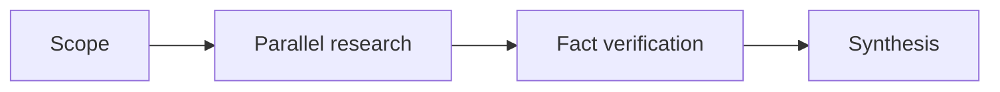
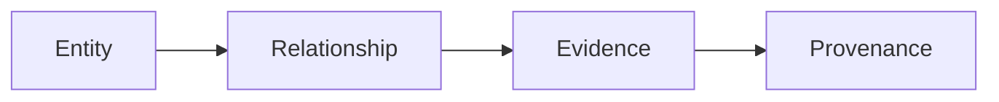
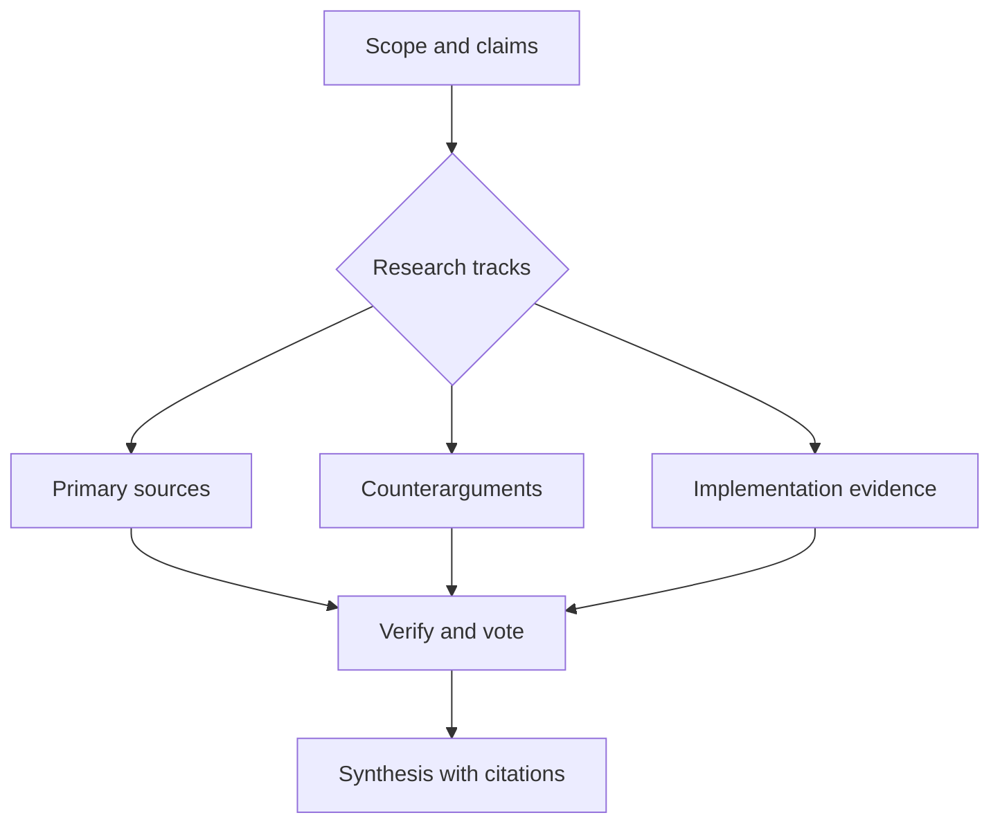
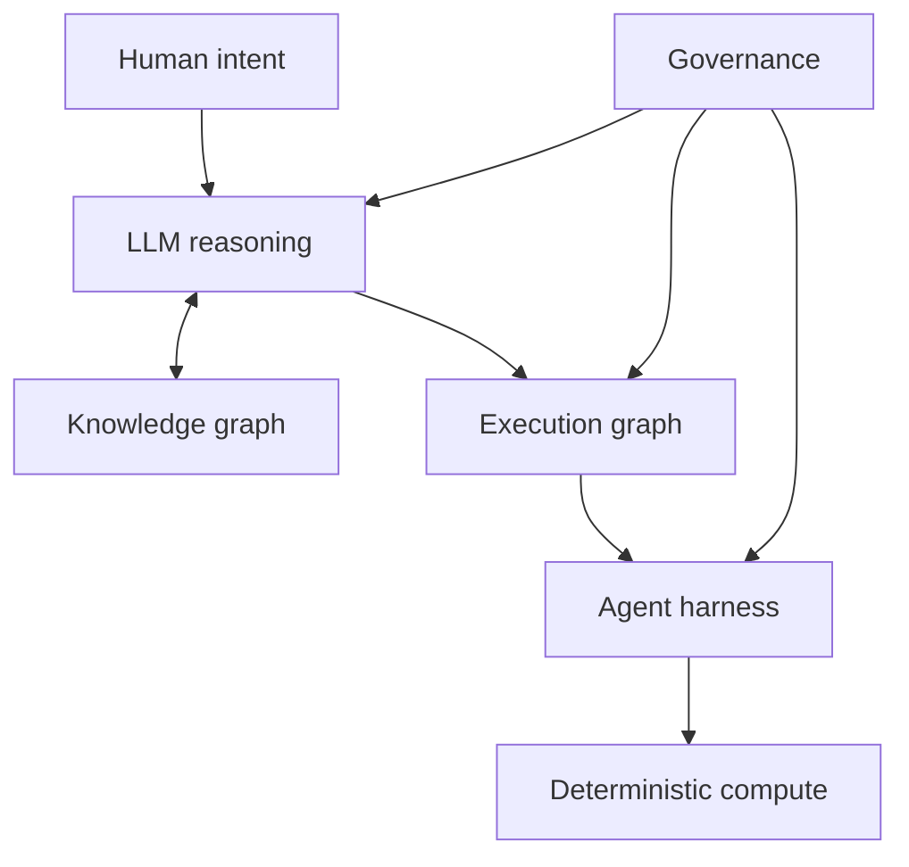

# Determinism is now a dial

For most of computing history, determinism was not a feature you debated. It
was the contract.

Given the same input and state, a deterministic system produces the same
output. SQL constrains queries and transactions. Kubernetes reconciles a
declared state. A compiler executes explicit rules. A test compares what
happened with what was expected to happen.

Large language models are useful precisely because they soften that contract.
They interpret ambiguity, choose among plausible meanings, and produce a
continuation rather than execute an instruction. That makes them a powerful
reasoning interface, but an unreliable place to put the final answer when the
answer must be repeatable.

The important question for AI-native systems is therefore not whether an
application is deterministic. It is **where each phase sits on a determinism
dial.**

> LLMs provide probabilistic reasoning, knowledge graphs preserve structured
> memory, and agent graphs determine how that reasoning is executed.

## 1. Determinism was the original contract

Traditional infrastructure works because the range of possible behaviour is
deliberately narrow. A database transaction either commits or it does not. A
backtest given the same market data, fees, code revision, and parameters should
produce the same statistics. A deployment controller should converge toward the
same target state, even if the path is noisy.

That discipline is not obsolete. It becomes more valuable when a probabilistic
model is part of the stack. The model may frame a question, rank an option, or
propose a plan. The calculation, state mutation, and external action should
still be owned by software with an inspectable contract.

## 2. LLMs cannot make the foundational jump

Tom Zahavy's position paper, *[LLMs can't jump](https://www.tomzahavy.com/projects/llms-cant-jump)*,
uses Einstein's account of scientific invention to distinguish three modes of
reasoning:

| Reasoning | Function |
| --- | --- |
| Deduction | Apply a known rule to a case |
| Induction | Infer a pattern or rule from examples |
| Abduction | Propose an explanation, cause, or new foundation |

The paper's claim is deliberately stronger than "models are not creative." It
argues that current LLMs can increasingly perform deduction and induction but
cannot reliably make the foundational abductive jump from experience to new
axioms. In its Einstein example, a system could reason from the equivalence
principle once it has been supplied. The harder question is where that premise
came from in the first place.


Whether one accepts the paper's categorical conclusion or not, its systems
implication is useful. The industry response has not been to solve abduction.
It has been to build dependable machinery around the model capabilities we can
observe, constrain, and check.

## 3. We moved responsibility out of the model

The evolution of applied LLM systems is a story of progressively relocating
responsibility from the model into the system around it.

### Completion engineering

```text
Prompt -> probable continuation
```

At this level, the model owns almost everything: interpretation, reasoning,
format, and result. It is quick to demonstrate and difficult to trust.

### Prompt engineering

Better instructions, demonstrations, and output formats narrow the response
space. The model remains the primary executor, but its task is better posed.

### Context engineering

We begin controlling the evidence, memory, and tools the model can see. A model
with a small, relevant, sourced context is not deterministic, but it is much
less free to invent its own universe.

### Harness engineering

The harness supplies the operational contract: structured outputs, tools, code
execution, tests, permissions, retries, sandboxes, and validation. A model may
propose an action; the harness decides whether that action is syntactically
valid, authorised, affordable, and safe to execute.

### Graph engineering

The next step is to coordinate capable agents and deterministic functions as
nodes in a workflow. Some nodes retrieve evidence. Some criticize. Some compute.
Some merely route. The graph makes dependencies, fan-out, joins, approvals, and
retries explicit.

> We did not make the model deterministic. We progressively moved
> responsibility from the model into the system around it.

## 4. Determinism is now a dial

The dial is not a maturity ladder. Lower-determinism phases are sometimes the
right choice, particularly when the problem is ambiguous or the cost of being
wrong is low. The point is to choose deliberately.

| Level | System behaviour | Example |
| ---: | --- | --- |
| 1 | Plain deterministic code | Backtester |
| 2 | Model fills a fixed schema | Structured extraction |
| 3 | Model operates inside fixed edges | Defined agent workflow |
| 4 | Model selects known routes | Classifier or router |
| 5 | Model freely selects tools | Tool-using agent |
| 6 | Model writes and executes code | Coding agent |
| 7 | Model constructs agent workflows | Multi-agent research |

Governance should set how far consequential work can move down the dial. A
marketing research brief may safely let an agent select tools. A payment, a
production deployment, or a published performance statistic should quickly
return to deterministic checks, fixed permissions, and explicit approvals.

## 5. Harness engineering becomes graph engineering

Two graphs matter, and they should not be confused.

An **execution graph** represents how work happens. It describes the order of
steps, parallel work, handoffs, retries, and gates.



A **knowledge graph** represents what the system knows. It connects entities,
relationships, evidence, constraints, and provenance.



The execution graph determines what happens next. The knowledge graph
determines what is already known, ruled out, or permitted. One controls process;
the other keeps process from rediscovering, contradicting, or laundering its own
claims.

## 6. Multi-agent research is an architectural demonstration

Research is a useful example because its natural shape is already graph-like.
Different agents can investigate independent claims in separate context windows,
then hand their evidence to verification and synthesis stages. That separation
helps prevent a single context from becoming a mixture of source material,
speculation, and conclusion.



Some systems dynamically generate portions of this workflow rather than using a
fixed DAG. That is a real capability, not a blanket recipe. It adds coordination
cost, model cost, latency, and a larger failure surface. A graph with a hundred
agents is one demonstration of dynamic orchestration, not a default operating
model.

## 7. The architecture of AI-native compute

The emerging stack is best understood as a reasoning and orchestration layer
above deterministic computation, not as a replacement for it.



The LLM is the interface that turns intent into candidate interpretations and
plans. The knowledge graph is structured memory rather than a bag of retrieved
text. The execution graph makes the plan runnable. The harness controls tools,
state, and side effects. Deterministic compute owns the work that must be
repeated exactly.


*Figure 2. A direct figure from Tom Zahavy, "LLMs can't jump" (2026), used in
the paper's discussion of the equivalence principle and manipulative abduction.
Source: [author-provided paper PDF](https://www.tomzahavy.com/files/llms-cant-jump.pdf).* 

The figure points at a boundary worth keeping in view. Models can work with
language about the world. A trustworthy computational system must also retain a
separate, grounded account of state, evidence, permissions, and results.

## 8. Governance makes the stack computable

Governance is not an afterthought appended to an agent after it has already
acted. It is part of the architecture.

- Permissions determine which tools are even visible to an agent.
- Provenance distinguishes source facts, model inferences, and deterministic
  outputs.
- Approval gates protect consequential actions.
- Versioned state enables reproduction and rollback.
- Cost limits constrain uncontrolled graph expansion.
- Deterministic engines own calculations.
- Audit trails record each decision, tool call, and mutation.

This is the practical form of the determinism dial. It determines which moves
are allowed at each stage and which claims can cross the boundary into a
decision, a customer interaction, or a permanent record.

> The model proposes. The graph coordinates. The harness constrains.
> Deterministic software executes.

## 9. A quant research system makes the boundary concrete

Consider a research stack for systematic investing. The LLM can generate and
critique hypotheses. An idea graph can remember which ideas were tested,
rejected, or superseded, along with the conditions that produced each outcome.
A workflow graph can coordinate builders, red teams, and evaluators.

But the backtester performs deterministic mathematics. Governance enforces
holdouts and trial counting. Provenance connects every reported Sharpe ratio,
drawdown, or turnover figure to an immutable engine run, dataset version, and
configuration.

The agent may propose a hypothesis, but it must never manufacture the result.
That is not a quant-specific rule. It is the general pattern for using
probabilistic reasoning around high-consequence computation.

## 10. A new abstraction for compute

SQL made data queryable. Kubernetes made infrastructure declarative. Knowledge
graphs may make organisational memory traversable, while LLM-driven execution
graphs make computation responsive to intent.

The shift is not the replacement of deterministic software. It is a new
reasoning and orchestration layer built above it. The systems that matter will
not ask a model to be deterministic. They will decide, phase by phase, where
probabilistic judgment adds value, where memory must be structured, and where
software must still produce the same answer every time.
